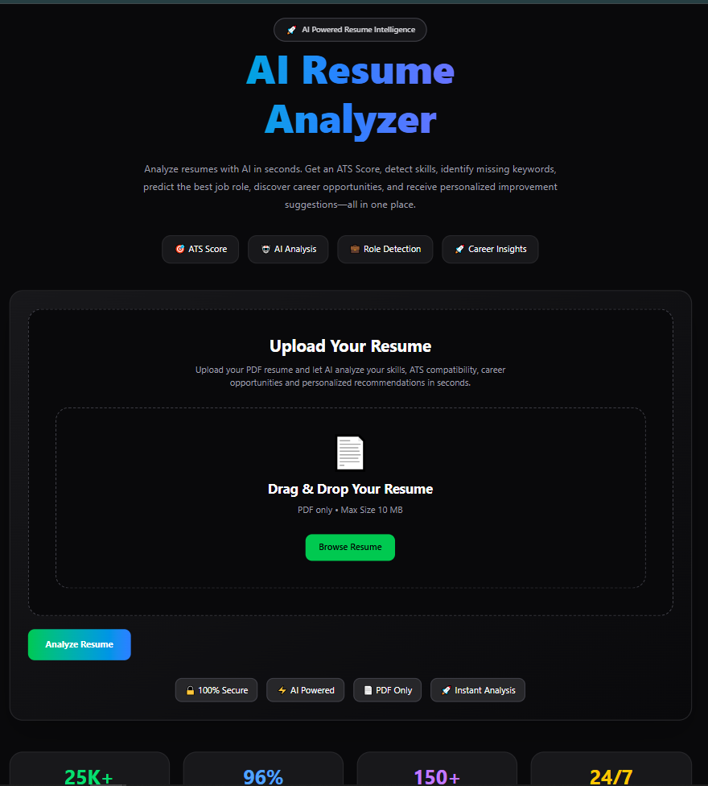
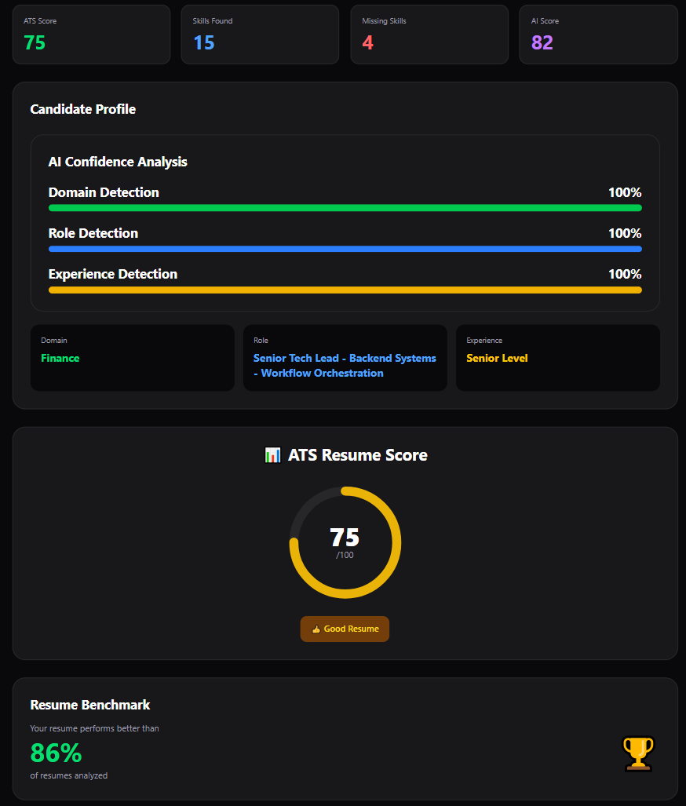

# 🤖 AI Resume Analyzer


# 🤖 AI Resume Analyzer

An AI-powered Resume Analyzer built using the MERN Stack and Ollama LLM.

It analyzes resumes, calculates ATS scores, detects job domains, predicts suitable job roles, identifies missing skills, and provides AI-powered career recommendations.

---

## ✨ Features

- 📄 Resume PDF Upload
- 🤖 AI Resume Analysis
- 🎯 ATS Score Prediction
- 💼 Domain Detection
- 👨‍💻 Job Role Prediction
- 📊 Experience Level Detection
- 🧠 Skill Extraction
- ❌ Missing Skills Detection
- 💡 AI Suggestions
- 📥 PDF Report Download
- ⚡ Fast Analysis
- 🎨 Modern UI

---

## 🛠 Tech Stack

### Frontend
- React
- Vite
- Tailwind CSS

### Backend
- Node.js
- Express.js
- Multer
- PDF-Parse

### AI
- Ollama
- Qwen 2.5

---

## 📂 Project Structure

AI-Resume-Analyzer

├── client/

├── server/

└── README.md

---

## 🚀 Installation

### Clone Repository

```bash
git clone https://github.com/vikashcse25/AI-Resume-Analyzer.git
```

### Frontend

```bash
cd client
npm install
npm run dev
```

### Backend

```bash
cd server
npm install
node index.js
```

---

## 📌 Current Features

- Resume Upload
- ATS Analysis
- AI Resume Review
- Skill Detection
- Missing Skill Analysis
- PDF Report Generation

---
## 📸 Screenshots

### 🏠 Home Page



### 🎯 ATS Analysis



Coming Soon...


## 🌐 Live Demo

Coming Soon...


## 🚀 Upcoming Features

- Resume Rewrite
- Cover Letter Generator
- Interview Question Generator
- Resume Builder
- Job Match Score
- LinkedIn Review
- Portfolio Review
- Salary Prediction
- Career Roadmap
- Multi-language Support

---

## 👨‍💻 Author

Vikash Kumar

GitHub:
https://github.com/vikashcse25

---

⭐ If you like this project, don't forget to star the repository.
